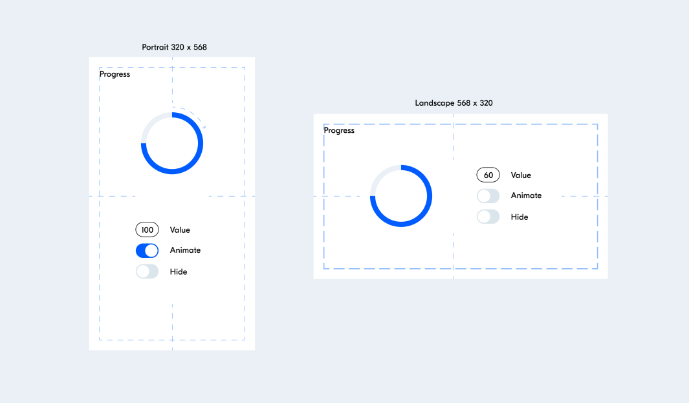

# Документация блока Progress

## Описание

Прототип блока Progress предназначен для отображения процесса выполнения различных задач в мобильных веб-приложениях. Блок позволяет управлять его состоянием и легко переиспользовать в других приложениях.

## Особенности

### Состояния блока

- **Normal:** Базовое состояние, в котором процесс выполнения отображается в виде дуги. Размер дуги изменяется путем установки значения параметра Value от 0 до 100. Начало дуги соответствует 12 часам, а конец дуги при увеличении параметра Value движется по направлению часовой стрелки и достигает начала при значении 100.

- **Animated:** Независимое состояние, при котором блок или его элементы начинают вращаться с некоторым периодом по часовой стрелке.

- **Hidden:** Состояние, скрывающее блок со страницы.

### Управление состоянием

Блок Progress предоставляет следующие элементы управления:

- **Value:** Текстовый ввод числа от 0 до 100, который управляет прогрессом выполнения задачи.
- **Animate:** Логический переключатель для включения или выключения анимации.
- **Hide:** Логический переключатель для скрытия или отображения блока.

### Адаптивность

Приложение адаптируется под ориентацию экрана, что позволяет эффективно использовать блок Progress на устройствах с разными размерами экрана.

## Технологии

- JavaScript (без использования сторонних библиотек).
- CSS.
- HTML (без использования шаблонизаторов).

## Дополнительная информация

Дополнительные инструкции по использованию и настройке блока Progress можно найти в комментариях к соответствующим разделам кода.

## Макет

